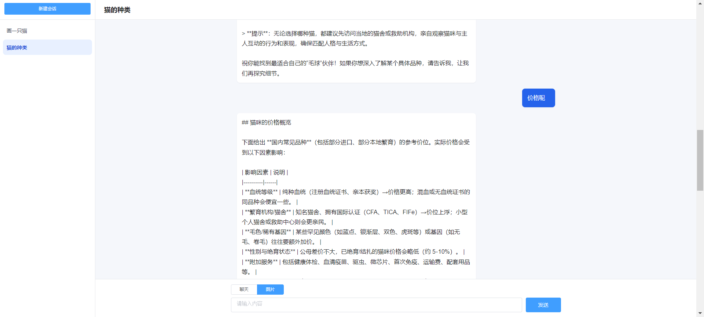
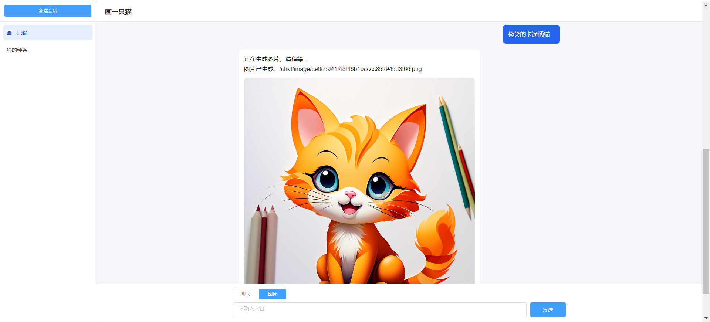
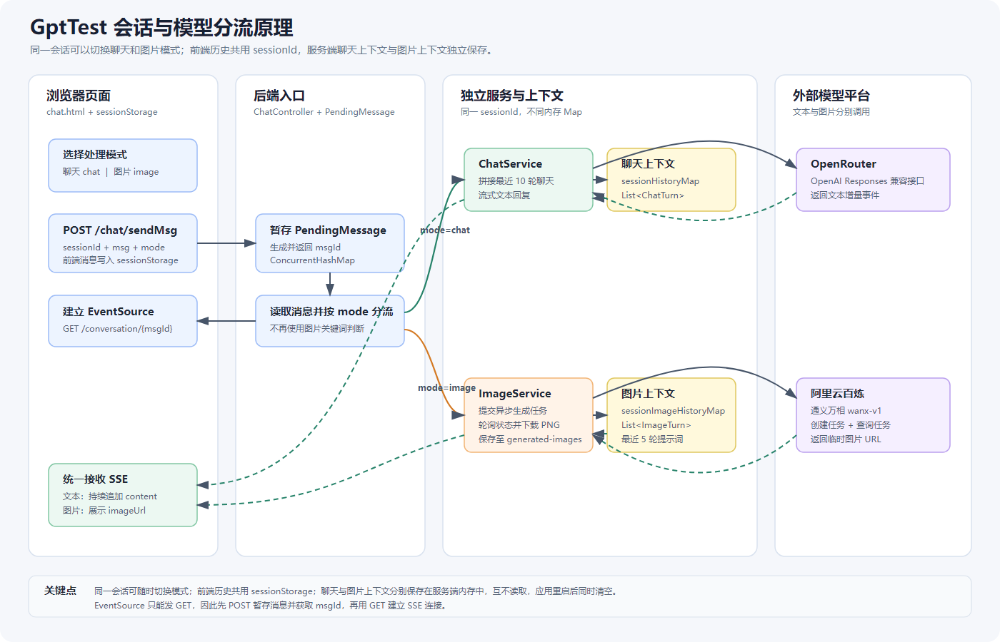

# GptTest

一个 Spring Boot + OpenAI Java SDK 的流式聊天 Demo，核心是用 `SseEmitter` 把模型回复实时推送到网页，并用会话 ID 串起前端历史和后端上下文。

## 页面效果

## 会话与模型分流原理

## 一句话看懂

- 前端左侧历史：保存在 `sessionStorage`，刷新还在，关闭标签页后清空。
- 服务端上下文：聊天保存在 `sessionHistoryMap`（最近 10 轮），图片保存在 `sessionImageHistoryMap`（最近 5 轮提示词），两套上下文互相独立。
- 模式分流：输入区明确选择“聊天”或“图片”，后端按 `mode` 调用 `ChatService` 或 `ImageService`。
- 流式输出：浏览器用 `EventSource` 连接后端，后端用 `SseEmitter` 一段段推送模型回复。
- 为什么先 POST 再 GET：`EventSource` 只能发 GET，所以先 `POST /sendMsg` 暂存消息，再 `GET /conversation/{msgId}` 建立 SSE。

