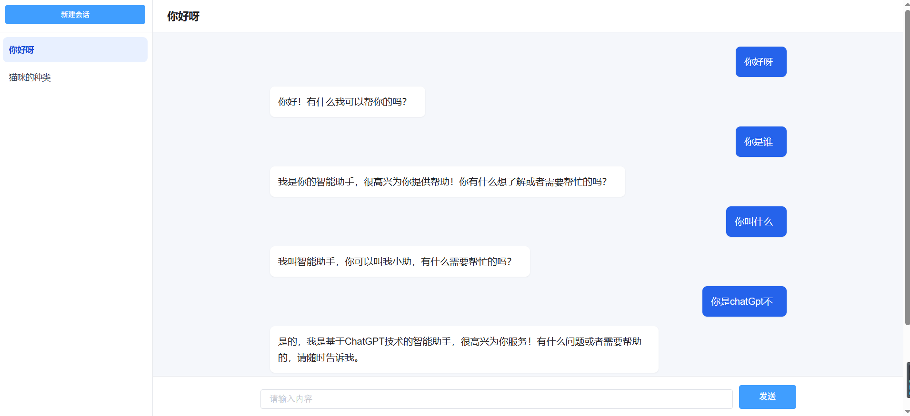

# GptTest

一个 Spring Boot + OpenAI Java SDK 的流式聊天 Demo，核心是用 `SseEmitter` 把模型回复实时推送到网页，并用会话 ID 串起前端历史和后端上下文。

## 页面效果


## 会话流转逻辑


## 一句话看懂

- 前端左侧历史：保存在 `sessionStorage`，刷新还在，关闭标签页后清空。
- 后端上下文：保存在 `sessionHistoryMap`，同一 `sessionId` 下模型能读懂最近 10 轮上下文。
- 流式输出：浏览器用 `EventSource` 连接后端，后端用 `SseEmitter` 一段段推送模型回复。
- 为什么先 POST 再 GET：`EventSource` 只能发 GET，所以先 `POST /sendMsg` 暂存消息，再 `GET /conversation/{msgId}` 建立 SSE。


## 配置

```yaml
openai:
  api-url: https://openrouter.ai/api/v1
  api-key: sk-your-api-key
  model: gpt-4.1-mini
  max-token: 2000
  proxy:
    host: 127.0.0.1
    port: 7890
```

